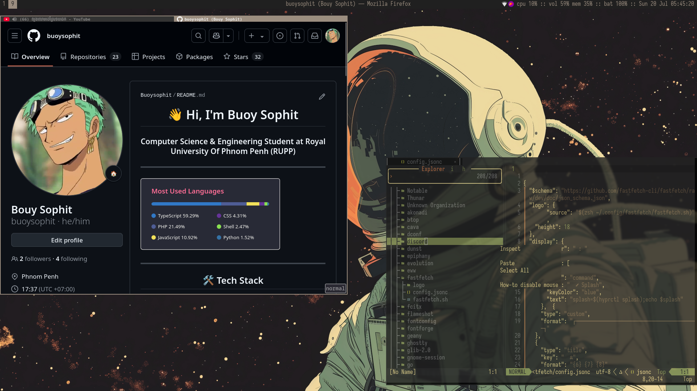
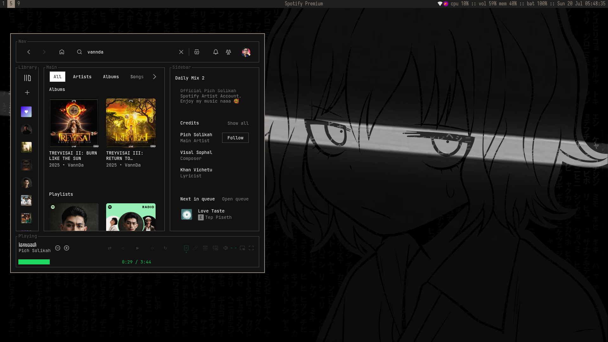
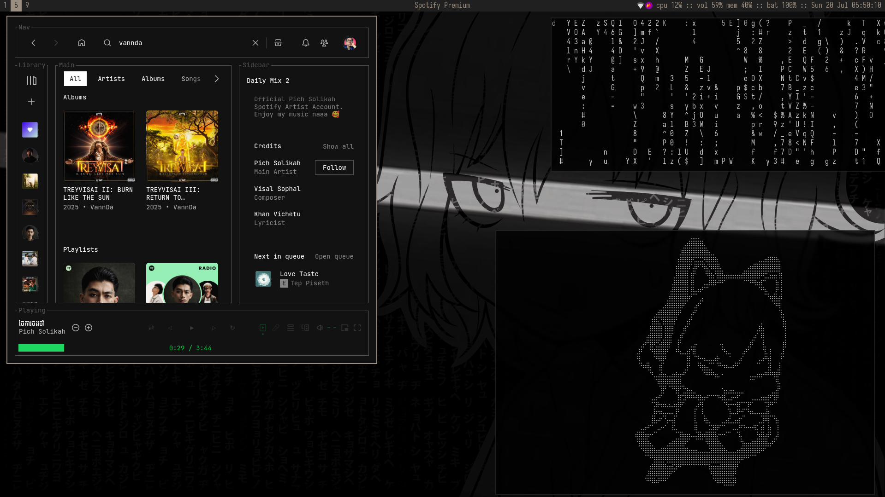
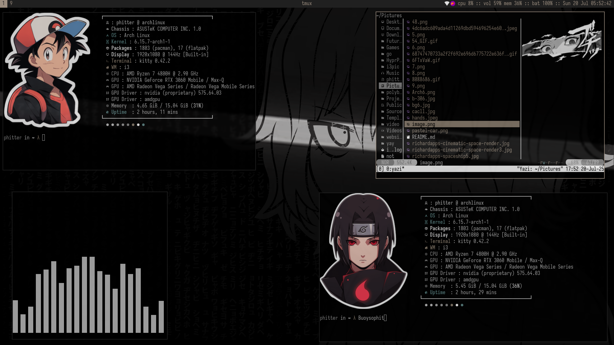
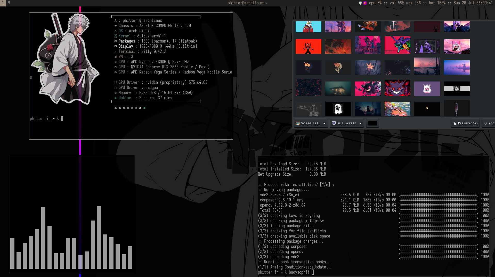

# 🌟 i3wm Arch Linux Dotfiles

A carefully crafted i3 window manager configuration for Arch Linux featuring a minimalist aesthetic with warm color schemes and efficient workflows.



## 🎨 Features

### Window Manager
- **i3wm** with custom keybindings and workspace management
- **Polybar** bottom panel with system monitoring
- **i3-gaps** for clean window spacing
- **Rofi** application launcher with custom styling
- **Picom** compositor for transparency effects

### Terminal & Shell
- **Kitty** terminal with custom themes
- **Zsh** shell configuration
- **Fastfetch** system information display

### Aesthetics
- Warm color palette (`#9b8d7f` primary accent)
- Iosevka font family throughout
- Pixel borders (2px) for clean lines
- Custom lockscreen with blur effects
- Nitrogen wallpaper management

### Applications & Tools
- **Rofi** power menu integration
- **Thunar** file manager
- **Firefox** browser
- **MPD/NCMPCPP** music setup
- **Cava** audio visualizer
- **Nvim** text editor configuration

## 🚀 Quick Start

### Prerequisites
```bash
# Install required packages
sudo pacman -S i3-wm i3status i3lock-color polybar rofi kitty picom nitrogen dunst
sudo pacman -S thunar firefox brightnessctl playerctl
```

### Installation
```bash
# Clone the repository
git clone https://github.com/yourusername/mydotfile-i3-wm.git
cd mydotfile-i3-wm

# Backup existing configs (if any)
mkdir -p ~/.config.backup
mv ~/.config/i3 ~/.config.backup/ 2>/dev/null || true
mv ~/.config/polybar ~/.config.backup/ 2>/dev/null || true

# Copy configurations
cp -r config/* ~/.config/
cp zshrc ~/.zshrc
cp zshenv ~/.zshenv

# Make scripts executable
chmod +x ~/.config/i3/lockscreen.sh
chmod +x ~/.config/polybar/launch.sh
chmod +x ~/.config/rofi/powermenu.sh
```

## ⌨️ Keybindings

### Core Shortcuts
| Key Combination | Action |
|-----------------|--------|
| `Super + Return` | Open terminal (Kitty) |
| `Super + f` | Open Firefox browser |
| `Super + d` | Application launcher (Rofi) |
| `Super + Shift + d` | Prime-run launcher |
| `Super + q` | Kill focused window |
| `Super + Shift + x` | Lock screen |
| `Super + Shift + m` | Power menu |

### Window Management
| Key Combination | Action |
|-----------------|--------|
| `Super + h/j/k/l` | Focus window (Vim keys) |
| `Super + Shift + h/j/k/l` | Move window |
| `Super + v` | Split vertical |
| `Super + Shift + v` | Split horizontal |
| `Super + Shift + f` | Toggle fullscreen |
| `Super + Shift + space` | Toggle floating |

### Workspace Navigation
| Key Combination | Action |
|-----------------|--------|
| `Super + y/u/i/o/p` | Switch to workspace 1-5 |
| `Super + 6/7/8/9/0` | Switch to workspace 6-10 |
| `Super + Shift + [num]` | Move container to workspace |

### System Controls
| Key Combination | Action |
|-----------------|--------|
| `XF86AudioRaiseVolume` | Volume up |
| `XF86AudioLowerVolume` | Volume down |
| `XF86AudioMute` | Toggle mute |
| `XF86MonBrightnessUp/Down` | Screen brightness |
| `Super + z` | Special mode (screenshots) |

## 🎯 Workspace Layout

- **Workspace 5**: Special layout with custom gaps (150px horizontal, 50px vertical, 10px inner)
- **General**: 5px inner gaps, 1px outer gaps
- **Auto-layout**: i3-autolayout for dynamic tiling

## 📊 System Monitoring

### Polybar Modules
- **i3**: Workspace indicator
- **CPU**: Usage percentage
- **Memory**: RAM usage
- **Battery**: Charge level (laptop)
- **Volume**: Audio level
- **Date/Time**: Current date and time
- **System Tray**: Application icons

### i3blocks Alternative
The setup includes an i3blocks configuration with:
- GPU temperature (NVIDIA)
- CPU usage
- Memory usage
- Battery status
- Volume control
- Date/time display

## 🌈 Color Scheme

```
Primary Accent: #9b8d7f (warm brown)
Background:     #222222 (dark gray)
Foreground:     #ffffff (white)
Glass Effect:   #9b8d7f (matching accent)
```

## 🖼️ Screenshots

### Desktop Overview


### Application Launcher


### Terminal & Editor


### System Information


### Multiple Workspaces


## 🔧 Configuration Details

### i3 Configuration Highlights
- **Font**: Iosevka 10pt
- **Border**: 2px pixel borders, no title bars
- **Floating modifier**: Super key
- **Display**: HDMI-A-0 at 1920x1080 @144Hz
- **Startup applications**: Dunst, NetworkManager, Blueman, etc.

### Polybar Setup
- **Position**: Bottom
- **Height**: 25px
- **Font**: Iosevka Nerd Font 12pt
- **Background**: #202020
- **Foreground**: #9b8d7f

### Kitty Terminal
- **Theme**: Black Metal Gorgoroth
- **Font**: Iosevka Nerd Font Mono 12pt
- **Features**: Background blur, cursor trail, dynamic opacity
- **Shell**: Zsh integration

### Picom Compositor
- **Backend**: GLX
- **Features**: Shadows, fading, vsync
- **Performance**: Hardware acceleration enabled

## 🎵 Audio & Media

### MPD Configuration
- Music Player Daemon setup
- NCMPCPP client configuration
- Audio visualization with Cava

### Volume Control
- PulseAudio integration
- Hardware key support
- Polybar volume display

## 🔒 Security Features

### Screen Locking
- i3lock-color with blur effect
- Custom styling matching theme
- Automatic screen timeout
- Touchpad tap-to-click enabled

## 📝 Additional Applications

### Text Editor
- Neovim configuration with Lua
- Custom keybindings and plugins

### File Management
- Thunar file manager
- Automatic mounting with udiskie

### Display Management
- Nitrogen wallpaper setter
- Multi-monitor support ready
- Custom resolution settings

## 🚨 Troubleshooting

### Common Issues

**Polybar not starting:**
```bash
killall polybar
~/.config/polybar/launch.sh
```

**i3lock not working:**
```bash
sudo pacman -S i3lock-color
```

**Font issues:**
```bash
sudo pacman -S ttf-iosevka-nerd
fc-cache -fv
```

## 📈 Performance

- Lightweight setup (~200MB RAM usage at idle)
- Fast application launching
- Smooth animations and transitions
- Battery-optimized settings included

## 🔄 Updates & Maintenance

```bash
# Update configuration
cd ~/mydotfile-i3-wm
git pull origin main

# Reload i3 configuration
Super + Shift + r

# Restart polybar
~/.config/polybar/launch.sh
```

## 🤝 Contributing

Feel free to fork this repository and submit pull requests for improvements. Issues and suggestions are welcome!

## 📄 License

This configuration is provided as-is for educational and personal use.

## 🙏 Credits

- **i3wm** community for the excellent window manager
- **Polybar** developers for the customizable status bar
- **Arch Linux** community for the documentation
- Various contributors to the dotfiles community

---

**Enjoy your new i3 setup! 🎉**

*Last updated: July 20, 2025*
